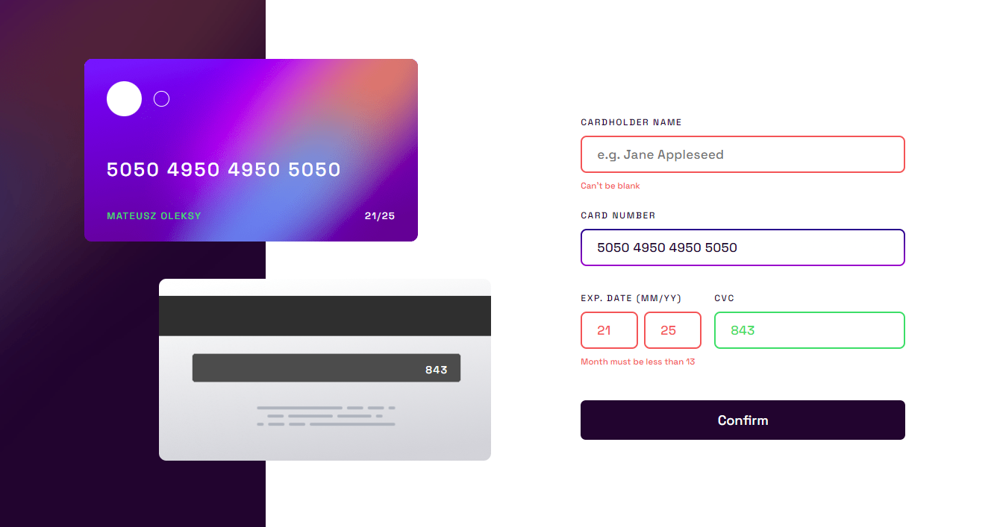

# [Frontend Mentor - Interactive card details form solution](https://interactivecard-detalis-xmavv.netlify.app/)

This is a solution to the [Interactive card details form challenge on Frontend Mentor](https://www.frontendmentor.io/challenges/interactive-card-details-form-XpS8cKZDWw)

## Table of contents

- [Overview](#overview)
  - [The challenge](#the-challenge) 
  - [Screenshot](#screenshot)
  - [Deploying project](#deploying-project)
- [My process](#my-process)
  - [Built with](#built-with)
  - [What I learned](#what-i-learned)
  - [What I added](#what-i-added)
  - [Useful resources](#useful-resources)
- [Author](#author)

### Welcome 😎

Thanks for checking out this front-end challenge!

## Overview

### The challenge

Users should be able to:

- Fill in the form and see the card details update in real-time
- Receive error messages when the form is submitted if:
  - Any input field is empty
  - The card number, expiry date, or CVC fields are in the wrong format
- View the optimal layout depending on their device's screen size
- See hover, active, and focus states for interactive elements on the page

### Screenshot

## My process

### Built with

- Semantic HTML5 markup
- CSS custom properties
- Flexbox
- Mobile-first workflow
- JS form valivadtion 

### What I learned

- Moblie first workflow
- Live display input on the card
- I bit of positioning
- Not a live full validation, but a bit of
- How to add gradient border on input:focus
- Responsive web design

### What I added

- Default input is a bit grey right now, when u type in yours, color changes to white
- I added second version of back-card, just to increase contrast between background and text-cvc (in my opinion default color wasn't that good, feel free to use it!)
- Success validation

### Useful resources

- [res1](https://www.youtube.com/watch?v=VB8cil2gyQM&list=PLbKtKAjLO1qzoGxx8CbErG3mW9yI9sbgq&index=3&ab_channel=mrkhd-webDev) - helped me with CSS, and JS

## Author

- my github profile - [xmavv](https://github.com/xmavv)
- my frontend mentor profile - [@xmavv](https://www.frontendmentor.io/profile/xmavv)
- my behance profile - [mav](https://www.behance.net/mavrgb)